# Prilinesha ANPR Backend — HLD & LLD

Design document for the ANPR (Automatic Number Plate Recognition) ingestion and management API.
This is the *design* companion to [README.md](README.md) (setup + API reference) and
[docs/SYSTEM-FLOW.md](docs/SYSTEM-FLOW.md) (flow diagrams).

- **Part A — [High Level Design](#part-a--high-level-design-hld)**: what the system is, who talks to it, how it is decomposed, and why.
- **Part B — [Low Level Design](#part-b--low-level-design-lld)**: schemas, indexes, algorithms, middleware contracts, per-module internals.

| | |
| --- | --- |
| **Runtime** | Node.js ≥ 20, Express 4 |
| **Datastore** | MongoDB 6+ via Mongoose 8 |
| **Blob storage** | Local filesystem (`uploads/`) |
| **Auth** | JWT access + refresh (dashboard) · SHA-256 hashed API keys (cameras) |
| **Entry point** | [server.js](server.js) → [app.js](app.js) |
| **Version** | 2.0.0 |

---

# Part A — High Level Design (HLD)

## 1. Problem statement

ANPR cameras at parking lots and residential societies detect vehicle number plates and must
answer one question at the gate: **is this vehicle allowed in?**

The backend has to:

1. **Ingest** detection events from Intozi camera servers (metadata + two base64 images), reliably and idempotently.
2. **Serve a registry** of permitted vehicles back to Intozi, so the gate barrier can decide locally and fast.
3. **Give operators a dashboard API** to register vehicles, manage gates, and read the detection log.
4. **Keep customers strictly apart** — one physical deployment, many customers, zero cross-visibility.

## 2. The organising idea: `group_id`

Everything hangs off one identifier. `group_id` **is** the project — the value the customer
configures in Intozi, which then arrives stamped on every event.

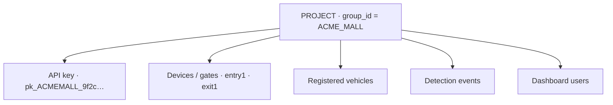

**Design consequence:** no query in the codebase reaches a collection without a `group_id` filter
attached, except an explicit super-admin read. Tenancy is not a feature layered on top — it is the
shape of every index and every service signature.

## 3. Context diagram

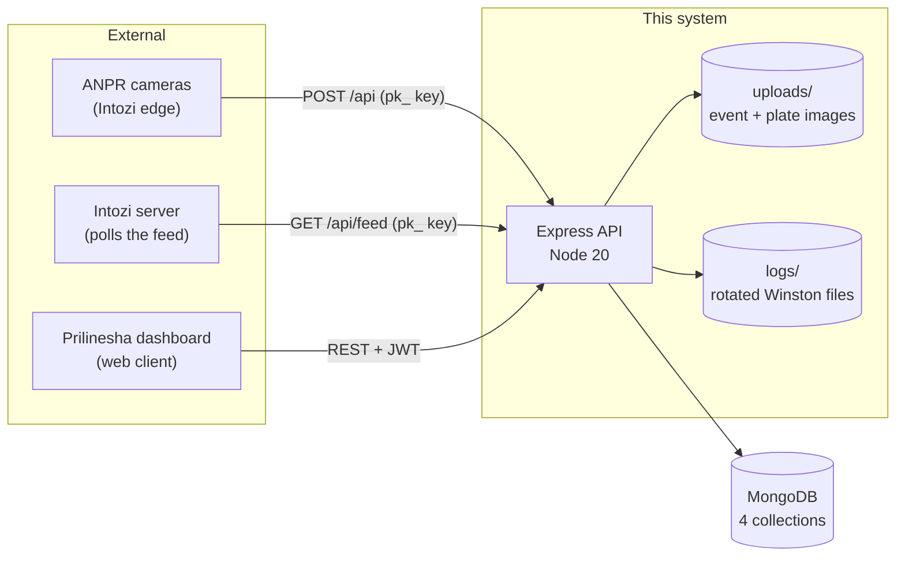

| Actor | Credential | Scope granted |
| --- | --- | --- |
| Intozi camera / server | `Authorization: Bearer pk_…` | Exactly one project |
| Legacy camera | `Authorization: Bearer <API_KEY>` | Unscoped (pre-projects compatibility) |
| Customer operator | `Authorization: Bearer <JWT>` | Only assigned `group_id`s |
| Prilinesha staff | `Authorization: Bearer <JWT>` | Every project, present and future |

## 4. Layered architecture

A strict one-way dependency chain. Each layer has exactly one job and never reaches past its
neighbour.

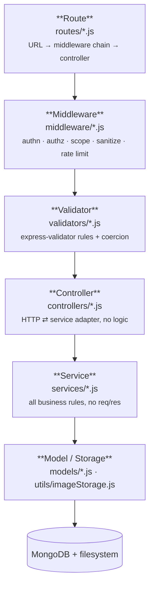

**Rules that hold everywhere:**

- Controllers never contain business logic; they unwrap `req`, call one service function, and shape the response.
- Services never see `req` or `res`. They take a validated payload plus a `scopeFilter` and a `{ actor, requestId }` context.
- Models own normalisation (uppercasing, trimming, hashing) so no service can bypass it.
- Every async handler is wrapped by [utils/asyncHandler.js](utils/asyncHandler.js); every error funnels to one handler.

## 5. Component inventory

| Component | Path | Responsibility |
| --- | --- | --- |
| Bootstrapper | [server.js](server.js) | Storage dirs → Mongo (retry) → `syncIndexes` → seed super admin → listen → graceful shutdown |
| App wiring | [app.js](app.js) | Middleware order, router mounting, Swagger, error pipeline |
| Env guard | [config/env.js](config/env.js) | Validates + coerces every variable; aborts boot on a bad `.env` |
| DB connector | [config/database.js](config/database.js) | Connect with exponential backoff, connection-state reporting |
| First-run seed | [config/bootstrap.js](config/bootstrap.js) | Creates/promotes the first `super_admin`, idempotently |
| Dashboard auth | [middleware/auth.js](middleware/auth.js) | `authenticate` · `authorize` · `requireProjectAccess` · `buildScopeFilter` |
| Machine auth | [middleware/apiKeyAuth.js](middleware/apiKeyAuth.js) | Project key lookup or constant-time global key compare |
| Ingestion | [services/anprService.js](services/anprService.js) | Event dedupe → status resolve → image write → insert → rollback; feed pagination |
| Registry | [services/vehicleService.js](services/vehicleService.js) | Register/renew, derive status, scoped CRUD |
| Projects | [services/projectService.js](services/projectService.js) | Project + device lifecycle, key rotation, customer login provisioning |
| Users | [services/userService.js](services/userService.js) | User admin, project assignment, role/status changes |
| Sessions | [services/authService.js](services/authService.js) | Login, refresh rotation + reuse detection, logout, password change |
| Log reader | [services/logService.js](services/logService.js) | Dashboard detection table with registry enrichment |

## 6. The two data flows that matter

### 6.1 Inbound — a camera reports a detection

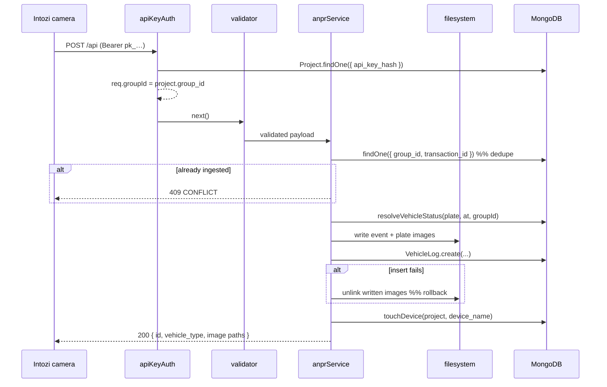

**Key decisions**

- The API key's project **overrides** any `group_id` in the body. A leaked key cannot write into another tenant.
- `vehicle_type` is resolved and **frozen at detection time**. A pass expiring tomorrow must not rewrite yesterday's log.
- Images are written before the DB insert and unlinked if it fails — no orphan files, no half events.
- Unknown `device_name`s are auto-registered on the project (flagged `auto_registered`) rather than dropping the event.

### 6.2 Outbound — Intozi polls the registry

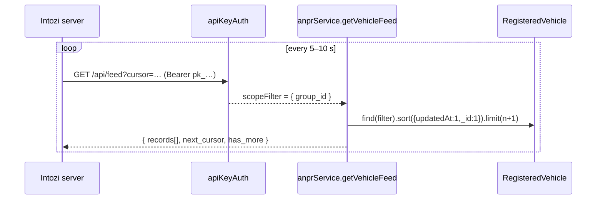

**Key decisions**

- The feed reads the **registry**, not the detection log. Intozi asks "which plates do you know about?", so a vehicle appears whether or not a camera ever saw it.
- Exactly **five fields** are disclosed (`FEED_DISCLOSED_FIELDS`): plate, group, status, `device_names` and `all_gates`. Owner name and phone stay internal. The gates are sent because `vehicle_type` alone is not a barrier decision — a pass limited to `entry1` is still `registered` at `exit2`.
- **Keyset cursor** over `(updatedAt, _id)`, not offset paging: rows inserted between two polls cannot cause a skip or a repeat.
- A cold caller with no cursor gets the **oldest** page first and walks forward via `has_more` — a plate skipped is a plate never delivered.
- Status is **derived per row at read time** from `valid_till` + `is_active`. No cron job, no stale status column.

## 7. Security architecture

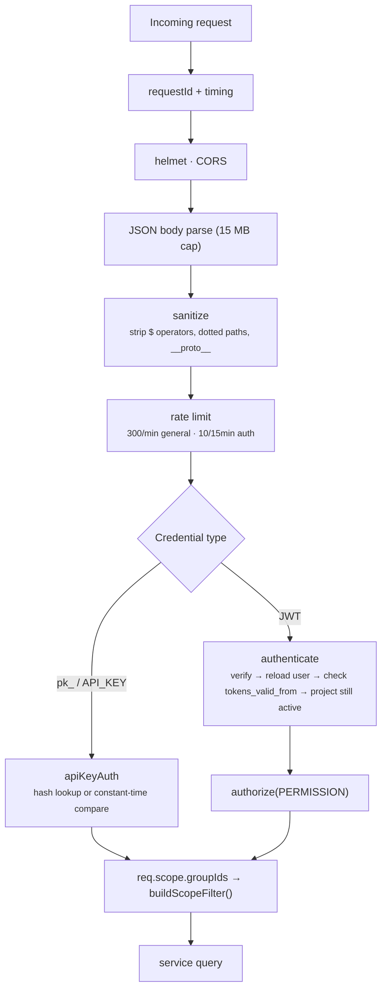

| Threat | Mitigation |
| --- | --- |
| NoSQL operator injection | [middleware/sanitize.js](middleware/sanitize.js) deletes `$`-prefixed and dotted keys to depth 8 |
| ReDoS via search terms | `escapeRegex()` in every service that builds a `RegExp` from user input |
| Credential theft from a DB dump | Passwords bcrypt(12); API keys and refresh tokens stored as SHA-256 only |
| Timing attack on the global key | `crypto.timingSafeEqual` over equalised SHA-256 digests |
| Stale authorisation | User reloaded from DB **every request**; `tokens_valid_from` retires tokens on password/role change |
| Refresh token replay | Single-use rotation; presenting the previous hash revokes **every** session on the account |
| Cross-tenant read | `scopeFilter` folded into the Mongo query, so out-of-scope single records are **404**, not 403 |
| Malicious upload | Magic-byte check (JPEG/PNG only), size cap, `flag: 'wx'` write, generated filenames |
| Password spraying | `authLimiter` with `skipSuccessfulRequests` — only failures accumulate |
| Enumeration via login | Dummy bcrypt hash compared for unknown emails so timing does not leak existence |

## 8. Authorisation model

Roles are deliberately only two; everything else is a **permission**, so a new capability never
needs a new role.

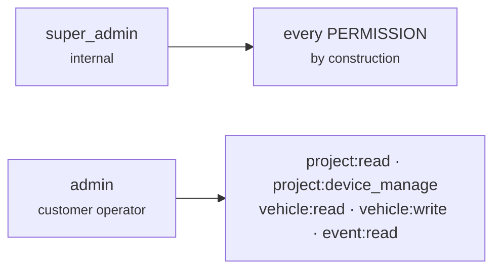

Three checks, always in this order:

1. **`authenticate`** — who are you? (JWT verified, user reloaded, account + projects still live)
2. **`authorize(PERMISSION)`** — may you do this at all? (`ROLE_PERMISSIONS` lookup)
3. **project scope** — on which projects? (`requireProjectAccess` for writes, `buildScopeFilter` for reads)

An account is **not** access: signup creates an `admin` with `projects: []`, which filters
everything out. A super admin assigning a `group_id` is the access grant, and it takes effect on
the user's next request — no re-login.

## 9. Non-functional design

| Concern | Approach |
| --- | --- |
| **Availability** | `/health` liveness (cheap, unauthenticated) · `/health/ready` returns 503 while Mongo is down so an LB drains the instance |
| **Startup safety** | Env validated before anything reads `process.env`; Mongo connect retries with exponential backoff capped at 30 s; boot aborts with exit 1 on failure |
| **Shutdown** | SIGINT/SIGTERM → stop accepting → drain in-flight → close Mongo → exit; hard timeout forces exit |
| **Index integrity** | `syncIndexes()` on all four models at boot, so production (`autoIndex: false`) still gets its unique constraints — and retired indexes are dropped |
| **Observability** | Winston, daily-rotated files + console, per-request UUID echoed as `X-Request-Id`, `X-Response-Time` header, base64 payloads never logged |
| **Throughput** | Mongo pool 2–20; feed reads are `.lean()` + covered by a compound index; page-size ceilings on every list |
| **Payload limits** | 15 MB JSON body, 10 MB per image, 50 devices per project |
| **Idempotency** | Unique index on `(group_id, transaction_id)` — the check *and* the index, because two concurrent deliveries race past the check |
| **Timeouts** | 30 s request timeout; `keepAliveTimeout` 65 s / `headersTimeout` 70 s to sit above a 60 s ALB idle timeout |

## 10. Deployment view

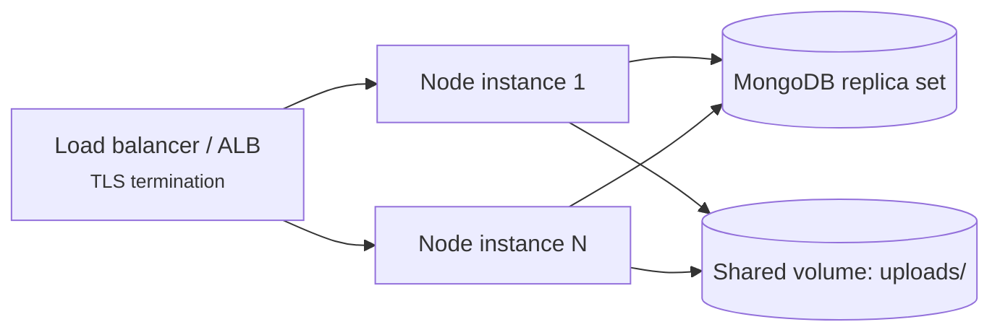

**Scaling notes and their limits**

- The API is **stateless** apart from the filesystem — rate-limit counters are in-memory, so horizontal scaling makes the per-IP budget effectively `N × max`. A shared store (Redis) is the fix when that matters.
- `uploads/` must be a **shared or object-backed volume** across instances, since any instance may serve an image written by another.
- Set `TRUST_PROXY` behind a proxy, or `req.ip` (and therefore rate limiting) reads the proxy's address.
- Refresh sessions live on the user document, so they work across instances with no sticky sessions.

---

# Part B — Low Level Design (LLD)

## 11. Directory map

```
prilinesha_backend_anpr/
├── server.js               # process lifecycle: boot, listen, graceful shutdown
├── app.js                  # express wiring only — no listen, no DB (importable by tests)
├── config/
│   ├── env.js              # validate + coerce every env var, abort on error
│   ├── database.js         # mongoose connect w/ backoff, state reporting
│   └── bootstrap.js        # idempotent first super_admin seed
├── routes/                 # URL → middleware chain → controller
├── middleware/             # auth, apiKeyAuth, validate, sanitize, rateLimiter,
│                           # requestContext, errorHandler
├── validators/             # express-validator rule sets, one per resource
├── controllers/            # HTTP ⇄ service adapters
├── services/               # all business logic
├── models/                 # Mongoose schemas + indexes + hooks
├── utils/                  # constants, jwt, apiKeys, passwords, imageStorage,
│                           # feedCursor, logger, AppError, asyncHandler
├── docs/                   # swagger spec + flow docs
├── scripts/backfillGroupId.js
├── uploads/{event,plate}-images/
└── logs/
```

## 12. Data model

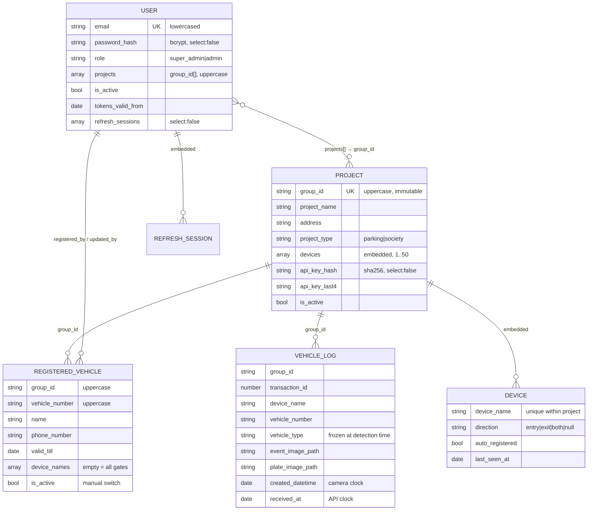

**Relationships are by value (`group_id`), not by ObjectId reference.** That is why deleting a
project is a *deactivation*: dropping the row would orphan every event and vehicle keyed on its
`group_id`, and a reused `group_id` would then inherit those orphans.

### 12.1 Index design

| Collection | Index | Purpose |
| --- | --- | --- |
| `vehiclelogs` | `{ group_id, transaction_id }` **unique** | Idempotency under concurrent delivery |
| | `{ group_id, created_datetime: -1 }` | Dashboard log table, newest first |
| | `{ group_id, vehicle_number, created_datetime: -1 }` | "Where has this plate been?" |
| | `{ group_id, received_at, _id }` | Feed cursor walk, per project |
| | `{ received_at, _id }` · `{ created_datetime: -1 }` | Unscoped (global key / super admin) equivalents |
| `registeredvehicles` | `{ group_id, vehicle_number }` **unique** | One registration per plate *per project* — re-adding renews |
| | `{ group_id, is_active, valid_till }` | Status filtering, "expiring soon" |
| | `{ group_id, updatedAt, _id }` | **The Intozi feed cursor** — the one query that must never degrade |
| | `{ group_id, createdAt: -1 }` | Default dashboard listing |
| `projects` | `{ group_id }` **unique** · `{ api_key_hash }` · `{ createdAt: -1 }` | Tenant identity · per-event auth lookup · listing |
| `users` | `{ email }` **unique** · `{ projects }` · `{ createdAt: -1 }` | One account per address · "who can see this project?" · listing |

`server.js` calls `syncIndexes()` on all four at boot. `syncIndexes` also **drops** indexes no
longer declared — that is what retired the old globally-unique plate index when registrations
became per-project.

### 12.2 Normalisation invariants

Enforced at the **schema** level so no code path can bypass them:

| Field | Rule | Why |
| --- | --- | --- |
| `group_id` (all collections) | `trim`, `uppercase` | `acme_mall` and `ACME_MALL` can never become two tenants |
| `vehicle_number` | `trim`, `uppercase` | The join key between log and registry must match on casing |
| `User.email` | `trim`, `lowercase` | `A@b.com` and `a@b.com` are one account |
| `User.projects[]` | `uppercase` | Must compare equal to `Project.group_id` |
| `User.password_hash` | bcrypt in a `pre('save')` hook | Plaintext cannot be persisted by forgetting a call |

## 13. Middleware contracts

Order in [app.js](app.js) is load-bearing:

```
requestId → responseTime → requestLogger → helmet → cors
  → json/urlencoded → sanitize → [static uploads] → [swagger]
  → /health
  → apiLimiter (on /api)
  → /api/auth · /api/users · /api/projects · /api/vehicles · /api/logs
  → /api  (anpr — mounted last so the specific prefixes above win)
  → notFoundHandler → errorHandler
```

### What each middleware sets on `req`

| Middleware | Sets | Notes |
| --- | --- | --- |
| `requestId` | `req.id` | Honours inbound `X-Request-Id`, echoes it back |
| `apiKeyAuth` | `req.project`, `req.groupId`, `req.authSubject`, `req.scope` | `pk_` → indexed hash lookup; otherwise constant-time compare against `API_KEY` |
| `authenticate` | `req.user`, `req.authSubject`, `req.scope` | Reloads the user; checks `is_active`, `tokens_valid_from`, and that assigned projects are still active |
| `requireProjectAccess` | `req.groupId`, rewrites `req.body.group_id` | Runs **after** validation (normalised value) and **before** the controller |

### The `req.scope` contract

Both auth paths produce the **same shape**, so services apply one scoping rule regardless of caller:

```js
req.scope = { groupIds: string[] | null, isSuperAdmin: boolean }
```

`buildScopeFilter(req, requested?)` turns it into a Mongo fragment:

| `scope.groupIds` | `?group_id=` | Filter produced |
| --- | --- | --- |
| `null` (super admin / root key) | absent | `{}` — every project |
| `null` | `ACME_MALL` | `{ group_id: 'ACME_MALL' }` |
| `['A','B']` | absent | `{ group_id: { $in: ['A','B'] } }` |
| `['A','B']` | `'C'` | throws **403** |
| `[]` (unassigned admin) | absent | `{ group_id: { $in: [] } }` — matches nothing |

The last row is the important one: an unassigned account sees **nothing**, not everything. `null`
is only ever produced for a super admin.

## 14. Request lifecycle, end to end

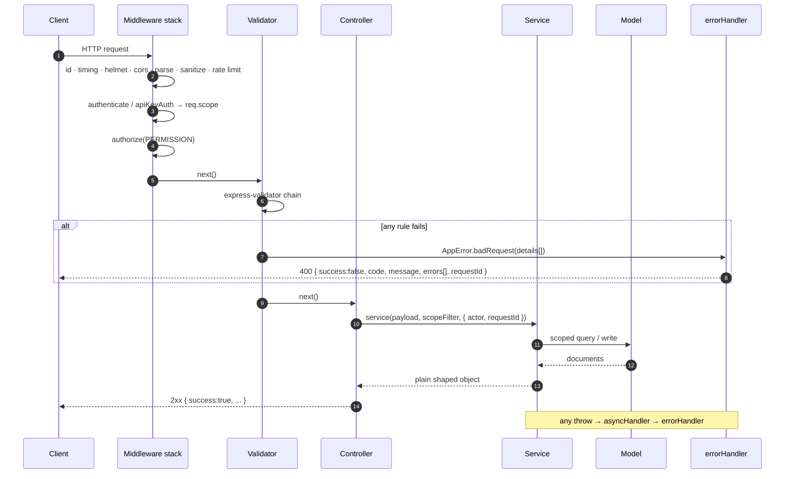

## 15. Error handling design

`AppError` carries `statusCode`, a stable machine `code`, a human `message`, and optional
per-field `details`. [middleware/errorHandler.js](middleware/errorHandler.js) normalises everything
else into it:

| Origin | Detected by | Becomes |
| --- | --- | --- |
| body-parser oversize | `error.type === 'entity.too.large'` | 413 |
| Malformed JSON | `entity.parse.failed` / `SyntaxError` | 400 |
| Mongoose validation | `error.name === 'ValidationError'` | 400 + `details[]` |
| Bad ObjectId | `error.name === 'CastError'` | 400 |
| Duplicate key | `error.code === 11000` | 409 |
| Anything else | — | 500, logged with stack |

Single response envelope, always:

```json
{
  "success": false,
  "code": "VALIDATION_ERROR",
  "message": "Request validation failed.",
  "errors": [{ "field": "valid_till", "message": "must be a future date" }],
  "requestId": "b3f1…"
}
```

Operational errors (< 500) log at `warn` with no stack; unexpected ones log at `error` with the
stack. Stacks are included in the response **only** outside production.

## 16. Module internals

### 16.1 `services/anprService.js` — ingestion

```
createAnprEvent(payload, { project, requestId })
  1. groupId ← project.group_id           # the key wins over the body, always
  2. VehicleLog.findOne({ group_id, transaction_id })  → 409 if found
  3. resolveVehicleStatus(plate, created_datetime, { groupId, device_name })
       └─ registry hit → 'registered' | 'unregistered'
       └─ registry miss → payload.vehicle_type ?? 'unregistered'
  4. saveEventImages(...)                 # self-rolls-back on partial failure
  5. VehicleLog.create({...})
       └─ catch 11000 → 409  (the concurrent-delivery race)
       └─ catch any   → removeFiles([...]) then rethrow
  6. touchDevice(project, device_name)    # bookkeeping, after the event is safe
```

**Why step 3 happens at ingest, not at read:** the stored event is an honest record of what the
vehicle's status *was* when it was seen. A registration expiring tomorrow cannot rewrite today's
detections.

### 16.2 `services/anprService.js` — the feed

```
getVehicleFeed({ cursor, since, limit, vehicleType }, scopeFilter)
  now       ← one Date for the whole page   # two rows expiring in the same ms must agree
  pageSize  ← min(limit ?? 100, 1000)
  filter    ← { ...scopeFilter }
  vehicleType filter (status is derived, so it compares fields, not a column):
      'registered'   → { is_active: { $ne: false }, valid_till: { $gte: now } }
      'unregistered' → { $and: [{ $or: [{ is_active: false }, { valid_till: { $lt: now } }] }] }
  cursor    → { $or: [ { updatedAt: { $gt: t } },
                       { updatedAt: t, _id: { $gt: id } } ] }   # ms-exact
  find(filter).select(5 fields).sort({ updatedAt: 1, _id: 1 }).limit(pageSize + 1).lean()
  has_more  ← fetched > pageSize            # the extra row answers it without a 2nd query
  records   ← page.map(toFeedRecord)        # built literally: 3 keys, never a delete
  next_cursor ← encode(last) ?? cursor      # empty poll keeps the caller's place
```

**Cursor wire format** ([utils/feedCursor.js](utils/feedCursor.js)):
`base64url("<ISO timestamp>|<ObjectId hex>")`. Opaque to the client, decodable in one step, and
`null` on any malformation → 400 rather than a silent full re-read.

### 16.3 `services/vehicleService.js` — derived status

Status is **never stored**. One function is the single source of truth for the dashboard table,
the ingest-time decision, and the feed:

```js
statusOf(record, at) =
  record.is_active === false        ? 'unregistered'
  : valid_till >= at                ? 'registered'
                                    : 'unregistered'
```

Two independent conditions, on purpose:

| Field | Who sets it | What it expresses |
| --- | --- | --- |
| `valid_till` | The pass's end date | Time-based expiry — implicit, no cron job can fail |
| `is_active` | A dashboard user | The cases a date cannot express: moved out, suspended pending payment |

A single stored `status` column would need a cron job to rewrite it the instant a pass expired,
and would silently disagree with `valid_till` the moment that job failed.

The dashboard view additionally returns `inactive_reason` (`'expired'` vs `'deactivated'`) and
`days_remaining` (negative once expired) so the UI never has to recompute either.

### 16.4 `services/authService.js` — token lifecycle

Two token kinds, different secrets, different jobs:

| | Access | Refresh |
| --- | --- | --- |
| Lifetime | 12 h | 30 d |
| Sent on | every request | `/api/auth/refresh` only |
| Claims | `sub`, `email`, `role`, `typ` | `sub`, `jti`, `typ` — nothing else |
| Secret | `JWT_SECRET` | `JWT_REFRESH_SECRET` (derived via HMAC if unset) |
| Revocable | via `tokens_valid_from` | individually, per session |
| Stored | not at all | SHA-256 only, in `user.refresh_sessions` |

**The access token deliberately does not carry the project list.** Projects change when a super
admin reassigns them; a baked-in claim would keep granting access to a project revoked an hour ago.
The middleware reloads the user instead — one indexed lookup buys immediate revocation.

**Rotation and reuse detection:**

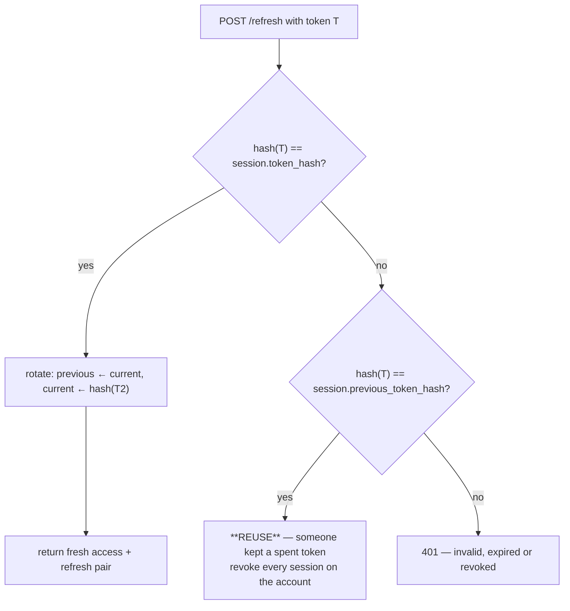

A deliberately revoked session is **deleted**, not moved to `previous_token_hash` — so logging out,
or being evicted by the session cap, does not look like theft.

Session cap (`MAX_ACTIVE_SESSIONS`, default 5) evicts by `last_used_at`, not `issued_at`: the least
recently used device is dropped, not the one that happened to log in first.

### 16.5 `utils/imageStorage.js` — upload pipeline

```
decodeBase64Image(raw, field)
  strip optional data-URI header + all whitespace
  reject: length % 4 ≠ 0 · non-base64 chars · empty · > MAX_IMAGE_BYTES
  magic bytes must match JPEG (FF D8 FF) or PNG (89 50 4E 47)   # a renamed .exe cannot land

buildFilename → "<kind>_<txnId>_<ISO compact>_<uuid8>.<ext>"
writeFile(..., { flag: 'wx' })                                   # never clobber

saveEventImages: both images optional; if the 2nd write fails, unlink the 1st
removeFiles: best-effort, never throws — the original error must survive
```

Images are **not** stored in Mongo. Documents hold relative paths only, keeping them small and
queries fast; `SERVE_UPLOADS` optionally exposes them via `express.static` with a 7-day cache.

### 16.6 `services/projectService.js` — project + device lifecycle

| Operation | Design note |
| --- | --- |
| `createProject` | Generates `pk_<GROUP>_<48 hex>`, stores **only** its SHA-256 + last 4. Plaintext is returned once and can never be shown again. |
| `create_login: true` | Provisions the customer's dashboard account from `contact_email`. An address that already has an account gets the project **added** to it, not a duplicate account. |
| `deleteProject` | Deactivation only, and idempotent. See §12 — relationships are by `group_id` value. |
| `rotateApiKey` | New key issued; cameras on the old one start failing immediately (no grace window, by design). |
| `touchDevice` | Called on every ingest. Updates `last_seen_at`; auto-registers an unknown gate with `auto_registered: true` so "a camera we never configured is posting" is visible without dropping the event. At the 50-device ceiling it logs and stops growing the list — a project that hits 50 this way is almost always one camera posting a malformed name. Wrapped in its own try/catch: an event already safely stored must never be reported as failed because bookkeeping failed. |
| `assertDashboardAccess` | Called from `authenticate`, so deactivating a project lands on the customer's **next request**. One indexed count for an admin; a super admin and an unassigned account return without querying. |
| Device cap | 1..50. The floor because a project with no gates can receive nothing; the ceiling because the project document is loaded and re-saved on every ingested event — the device list is on the hot path. |

### 16.7 API key format

```
pk_ACMEMALL_9f2c7b1e…            # 48 hex chars = 192 bits of entropy
└┬┘ └───┬──┘ └──────┬─────┘
 │      │           └─ crypto.randomBytes(24)
 │      └─ group slug: a key found in a config file is traceable without a query
 └─ prefix: recognisable on sight, and lets auth skip a DB lookup for the global key
```

SHA-256, **not** bcrypt — the input is generated randomness with no dictionary to defend against,
and the ingest path authenticates on every event, so it must be an indexed lookup rather than a
per-candidate hash comparison. The same reasoning applies to refresh-token hashes.

## 17. Endpoint map

| Method | Path | Auth | Permission |
| --- | --- | --- | --- |
| `GET` | `/health` · `/health/ready` | none | — |
| `POST` | `/api/auth/signup` | none *(rate-limited)* | — |
| `POST` | `/api/auth/login` | none *(rate-limited)* | — |
| `POST` | `/api/auth/refresh` | refresh token in body | — |
| `POST` | `/api/auth/logout` | JWT | — |
| `GET` | `/api/auth/me` | JWT | — |
| `POST` | `/api/auth/change-password` | JWT | — |
| `POST`/`GET` | `/api/users` | JWT | `user:manage` / `user:read` |
| `GET` | `/api/users/:id` | JWT | `user:read` |
| `PUT` | `/api/users/:id/projects` | JWT | `user:assign_project` |
| `PATCH` | `/api/users/:id/role` · `/status` | JWT | `user:manage` |
| `POST` | `/api/users/:id/reset-password` | JWT | `user:manage` |
| `POST`/`GET` | `/api/projects` | JWT **+ super admin** | `project:create` / `project:read` |
| `GET`/`PATCH`/`DELETE` | `/api/projects/:group_id` | JWT **+ super admin** | `project:read` / `:update` / `:delete` |
| `POST` | `/api/projects/:group_id/rotate-key` | JWT | `project:rotate_key` |
| `POST`/`PATCH`/`DELETE` | `/api/projects/:group_id/devices[/:device_name]` | JWT | `project:device_manage` |
| `POST`/`GET` | `/api/vehicles` | JWT | `vehicle:write` / `vehicle:read` |
| `GET`/`PATCH`/`DELETE` | `/api/vehicles/:id` | JWT | `vehicle:read` / `vehicle:write` |
| `PATCH` | `/api/vehicles/:id/status` | JWT | `vehicle:write` |
| `GET` | `/api/logs` | JWT | `event:read` |
| `POST` | `/api` | **API key** | — |
| `GET` | `/api/feed` | **API key** | — |

Interactive reference: `/api-docs` (Swagger UI) · [postman/ANPR-API.postman_collection.json](postman/ANPR-API.postman_collection.json)

## 18. Status code semantics

| Code | Meaning here |
| --- | --- |
| `200` | OK — including a **renewal** of an already-registered plate |
| `201` | Created — a new record |
| `400` | Validation failed (`errors[]` names the field) · malformed cursor · missing `group_id` when the caller has several projects |
| `401` | Missing/invalid/expired credential · reused refresh token · account deactivated |
| `403` | Authenticated but not permitted: wrong role, project not in scope, project deactivated, signup disabled |
| `404` | Unknown route · unknown record **· a record that exists in someone else's project** |
| `409` | Duplicate `transaction_id` · `group_id` taken · email taken · last device removal |
| `413` | Payload above `JSON_BODY_LIMIT` |
| `429` | Rate limit exceeded |
| `500` | Unexpected — logged with a stack, `requestId` returned to quote |

**404-not-403 for single records** is deliberate: an ObjectId is opaque and guessable in bulk, so
answering "that exists, but it is not yours" would confirm which ids are real, and for whom.
List endpoints scope by folding the filter into the query, so out-of-scope rows are simply absent.

## 19. Pagination strategies — and why there are two

| | Dashboard lists | Intozi feed |
| --- | --- | --- |
| Style | Offset (`page` / `limit` + `total`) | Keyset cursor over `(updatedAt, _id)` |
| Needs | Page numbers, a row count, jump-to-page | Exactly-once delivery, no gaps or repeats |
| Cost of drift | An operator sees a row twice — harmless | A plate never delivered — a gate opens wrongly |
| Defaults | 25 · max 200 (logs, registry) / 100 (projects, users) | 100 · max 1000 |

Offset paging drifts as rows are inserted between two requests. That is acceptable for a human
scrolling a table and unacceptable for a poller whose job is to receive every record once.

## 20. Configuration surface

Validated at boot by [config/env.js](config/env.js); a bad value prints every problem at once and
exits 1.

| Group | Variables |
| --- | --- |
| **Required** | `MONGO_URI` · `API_KEY` · `JWT_SECRET` (≥ 32 chars) |
| Runtime | `NODE_ENV` · `PORT` (5050) · `REQUEST_TIMEOUT_MS` (30 000) · `SHUTDOWN_TIMEOUT_MS` (10 000) |
| Mongo | `MONGO_MAX_RETRIES` (10) · `MONGO_RETRY_DELAY_MS` (3 000) · `MONGO_SERVER_SELECTION_TIMEOUT_MS` (10 000) |
| Tokens | `JWT_EXPIRES_IN` (12h) · `JWT_ISSUER` · `JWT_REFRESH_SECRET` *(derived if unset)* · `JWT_REFRESH_EXPIRES_IN` (30d) · `MAX_ACTIVE_SESSIONS` (5) · `BCRYPT_ROUNDS` (12) |
| Bootstrap | `SUPER_ADMIN_EMAIL` / `_PASSWORD` / `_NAME` · `SIGNUP_ENABLED` |
| Limits | `RATE_LIMIT_WINDOW_MS` (60 s) / `_MAX` (300) · `AUTH_RATE_LIMIT_WINDOW_MS` (15 min) / `_MAX` (10) · `JSON_BODY_LIMIT` (15mb) · `MAX_IMAGE_BYTES` (10 MB) |
| Storage | `UPLOAD_DIR` · `UPLOAD_PUBLIC_PATH` · `SERVE_UPLOADS` |
| Ops | `CORS_ORIGIN` · `TRUST_PROXY` · `LOG_LEVEL` · `LOG_DIR` · `SWAGGER_ENABLED` |

**Guards beyond presence checks:** placeholder `API_KEY`/`JWT_SECRET` rejected in production ·
`JWT_REFRESH_SECRET` must differ from `JWT_SECRET` (a shared key lets an access token be replayed
as a refresh token) · `SUPER_ADMIN_EMAIL` and `_PASSWORD` must be set together, because a
half-configured bootstrap silently seeds nothing and looks like a broken login.

## 21. Boot and shutdown sequence

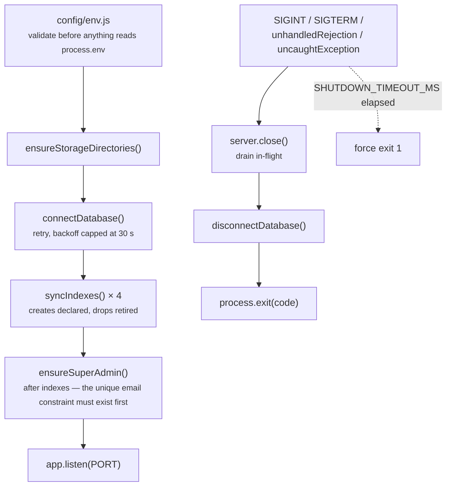

Any boot failure exits non-zero so a process manager (pm2, systemd, Kubernetes) restarts or
reports it.

## 22. Migration / operations

**`scripts/backfillGroupId.js`** — `group_id` became required on registered vehicles, so rows
written before that change are invisible to every scoped query.

```bash
node scripts/backfillGroupId.js ACME_MALL           # dry run, reports what it would change
node scripts/backfillGroupId.js ACME_MALL --apply   # writes
```

Idempotent: it only touches documents that have no `group_id`.

## 23. Known limitations and where to extend

| Limitation | Impact | Direction |
| --- | --- | --- |
| Rate-limit counters are in-memory | Per-IP budget multiplies by instance count | Redis-backed store for `express-rate-limit` |
| Images on local disk | Requires a shared volume across instances | S3 / object storage adapter behind `imageStorage`'s interface |
| Ingest is fully synchronous | Image write + insert sit in the request path | Queue the write, ack the camera earlier |
| Log listing uses offset paging | Deep pages get expensive as events accumulate | Cursor paging for the log table too, once operators reach that depth |
| No automated test suite | Regressions rest on review | `app.js` is already side-effect-free and importable — supertest + `mongodb-memory-server` drop straight in |
| Legacy global `API_KEY` is unscoped | One secret can read and write every project | Retire once all cameras hold `pk_` keys |
| Device list is embedded and re-saved per event | Bounded at 50 for exactly this reason | Separate collection if sites ever outgrow it |

---

## Related documents

- [README.md](README.md) — setup, environment, full API reference with examples
- [docs/SYSTEM-FLOW.md](docs/SYSTEM-FLOW.md) — auth, tenancy and onboarding flow diagrams
- [docs/INTOZI-INTEGRATION.md](docs/INTOZI-INTEGRATION.md) — the camera-side integration contract
- `/api-docs` — live Swagger UI when `SWAGGER_ENABLED=true`
