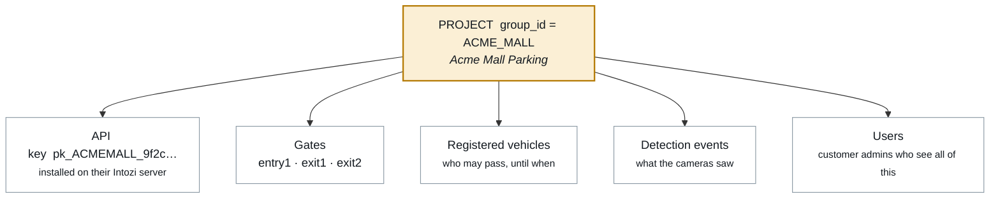
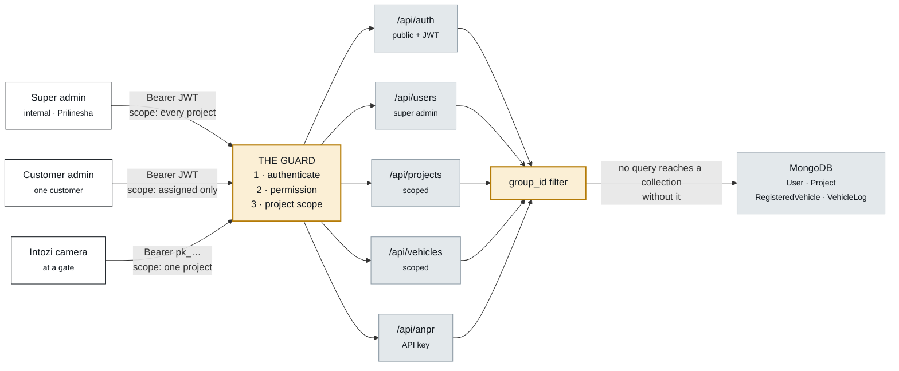
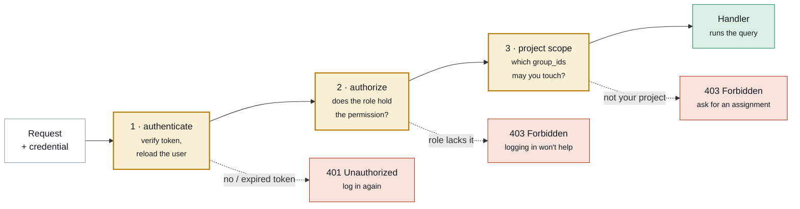
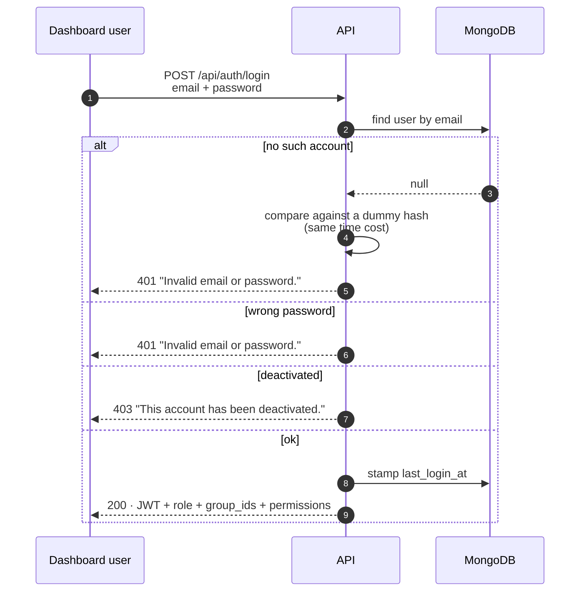
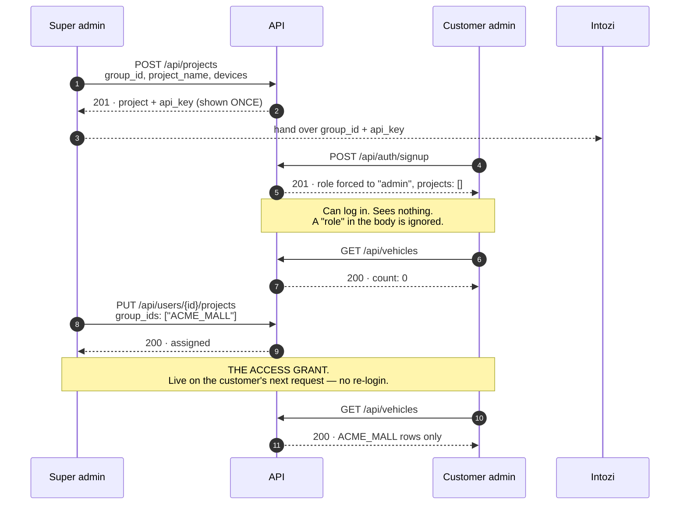
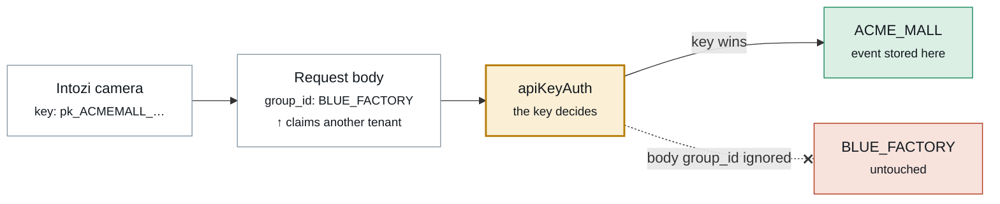
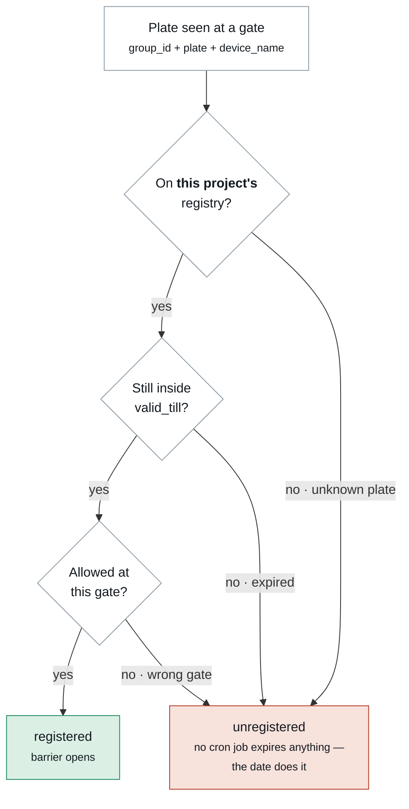
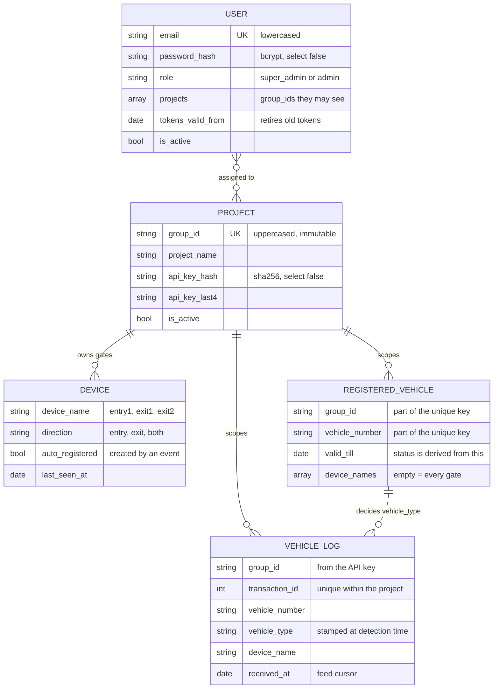

# How the system works

Flow diagrams for the Prilinesha ANPR backend — how a caller proves who it is, and how the answer
gets narrowed to exactly one customer's data.

- [1. The one idea: `group_id`](#1-the-one-idea-group_id)
- [2. System map](#2-system-map)
- [3. Two ways to authenticate](#3-two-ways-to-authenticate)
- [4. How a request is authorized](#4-how-a-request-is-authorized)
- [5. Login](#5-login)
- [6. Onboarding — an account is not access](#6-onboarding--an-account-is-not-access)
- [7. Tenant isolation](#7-tenant-isolation)
- [8. How `registered` / `unregistered` is decided](#8-how-registered--unregistered-is-decided)
- [9. Roles and permissions](#9-roles-and-permissions)
- [10. Data model](#10-data-model)
- [11. Endpoint map](#11-endpoint-map)
- [12. What each status code means](#12-what-each-status-code-means)

---

## 1. The one idea: `group_id`

Everything hangs off a single identifier. `group_id` **is** the project — the value your customer
types into their Intozi configuration and that arrives on every event.



Nothing is shared between projects. The same plate registered under `ACME_MALL` and `BLUE_FACTORY`
is **two independent records**, and neither project can see the other's.

---

## 2. System map

Two kinds of credential reach this API. Both enter through the same guard, and neither reaches the
database without a `group_id` filter attached.



> The guard is not per-route decoration — it is the same three middleware layers everywhere. Nothing
> reaches a collection without passing it.

Traffic on `/api/anpr` goes both ways: the camera **posts** detections, and Intozi **polls**
`GET /api/anpr/feed` every 5–10 seconds for the answer. Both directions are scoped by the same key,
so a poller only ever sees its own project's events.

---

## 3. Two ways to authenticate

| Caller | Credential | Scope it grants |
| --- | --- | --- |
| Dashboard user | `Authorization: Bearer <JWT>` from `/api/auth/login` | `super_admin` → every project, present and future. `admin` → only assigned projects. |
| Intozi / camera | `Authorization: Bearer pk_…` (per-project key) | Exactly one project. |
| Legacy camera | `Authorization: Bearer <API_KEY>` (shared secret) | Unscoped — every project. Kept for cameras deployed before projects existed. |

A project key looks like `pk_ACMEMALL_<48 hex chars>`. The group is embedded so a key found in a
config file is traceable; the entropy is entirely in the suffix. **Only its SHA-256 is stored** — a
database dump yields no working camera credential.

---

## 4. How a request is authorized

Authorization is not one check. It is three, and they fail differently on purpose: *who are you*,
*may you do this at all*, and *on whose data*.



**Stage 1** re-reads the user from the database rather than trusting the token's claims. That one
extra indexed lookup is what makes revocation immediate.

**Stage 3** turns the caller into a Mongo filter:

| Caller | Filter applied |
| --- | --- |
| Super admin | *(none)* — every project |
| Admin, `?group_id=ACME_MALL` | `group_id: "ACME_MALL"` |
| Admin, no parameter | `group_id: { $in: ["ACME_MALL", …] }` |
| Admin with no assignments | `group_id: { $in: [] }` → **matches nothing, never everything** |

> That last row is the important one. The failure mode of a bug here is seeing too *little*.

### Why routes name permissions, not roles

A route asks for `vehicle:write`, never for "admin". Adding an API later means adding one entry to
`ROLE_PERMISSIONS` in [`utils/constants.js`](../utils/constants.js) and listing it under whichever
roles should have it — **no route, controller or middleware changes**. `super_admin` holds every
permission by construction, so a new one can never be accidentally withheld from you.

---

## 5. Login



A wrong email and a wrong password return the **identical** 401, and take comparable time — so the
endpoint cannot be used to discover which addresses are registered.

The token carries identity only (`id`, `email`, `role`). It deliberately does **not** carry the
project list: projects change when you reassign them, and a claim baked into a 12-hour token would
keep granting access to a project revoked an hour ago.

---

## 6. Onboarding — an account is not access

This is the part worth being precise about. A new user can log in the moment they register and still
see absolutely nothing. The access is a separate, deliberate act by you.



`mode` on the assignment is `replace` (default), `add` or `remove`. Assigning a `group_id` that does
not exist is rejected with `400` — a typo would silently grant access to nothing and look like a bug.

**Revocation works the same way, in reverse.** Removing a project, changing a role, or
`PATCH /api/users/{id}/status` with `is_active: false` takes effect on the user's very next request
rather than when their token happens to expire.

---

## 7. Tenant isolation

Each project carries its own API key. **The key decides** which project an event is filed under — so
a `group_id` in the request body cannot redirect a camera into someone else's data, even if the key
leaks.



The same rule governs reads: `GET /api/anpr/feed` with a project key returns that project's events
only, and naming a different `group_id` is a `403` rather than a wider result.

### What actually holds the wall up

| Guard | Effect |
| --- | --- |
| Empty scope is `{ $in: [] }` | An unassigned admin matches **nothing**, never everything |
| `role` in the signup body is ignored | The public endpoint cannot mint a super admin |
| User reloaded from the DB every request | A revoked project stops working immediately |
| Unique on `group_id + vehicle_number` | The same plate at two sites is two records that never meet |
| Unique on `group_id + transaction_id` | Two customers can legitimately both send `4471` |
| Only the SHA-256 of a key is stored | A database dump yields no working credential |
| `password_hash` is `select: false` | It cannot leak through a forgotten projection |
| `tokens_valid_from` | Password change, role change and deactivation retire old tokens |

---

## 8. How `registered` / `unregistered` is decided

The camera does not get the last word. When an event arrives, the plate is looked up in **that
project's** registry and judged at detection time — so a registration expiring tomorrow cannot
rewrite what happened today.



Notes on each check:

1. **Registry lookup is scoped.** A vehicle registered at one customer's site is a stranger at
   another's. A camera on the legacy unscoped key has no registry to consult and falls back to
   whatever the payload claimed.
2. **`valid_till` is inclusive.** A date sent without a time is stored as `23:59:59.999` UTC of that
   day, so "valid till the 31st" means the whole 31st.
3. **`device_names` is usually empty**, which means every gate in the project. A registration limited
   to `["entry1"]` reports `unregistered` at `exit1` — which is exactly what the barrier should do.

The status is **stamped on the stored event**, not recomputed when the feed is read. Each detection
stays an honest record of what the vehicle was at the moment it was seen.

### What the feed discloses

`GET /api/anpr/feed` returns the plate and its status. Every other field is `null` **by contract**,
even when the database holds a value:

```json
{
  "owner_name": null, "created_datetime": null, "contact_no": null,
  "email": null, "driver_name": null, "vehicle_model": null,
  "vehicle_type": "registered",
  "vehicle_number": "MH12AB1234"
}
```

---

## 9. Roles and permissions

There is deliberately **no third role**. Everything else is a permission, so you can widen what a
customer admin may do without inventing roles or migrating anyone.

| Capability | `super_admin` | `admin` | Permission |
| --- | :---: | :---: | --- |
| See every project, including future ones | ✅ | ❌ | *(by role)* |
| Create projects & issue Intozi API keys | ✅ | ❌ | `project:create` |
| Read projects | ✅ | ✅ own | `project:read` |
| Update / deactivate a project | ✅ | ❌ | `project:update` |
| Rotate a project's API key | ✅ | ❌ | `project:rotate_key` |
| Manage gates (`entry1`, `exit2` …) | ✅ | ✅ own | `project:device_manage` |
| Read the vehicle registry | ✅ | ✅ own | `vehicle:read` |
| Register & renew vehicles | ✅ | ✅ own | `vehicle:write` |
| Read detection events | ✅ | ✅ own | `event:read` |
| List users | ✅ | ❌ | `user:read` |
| Create users, change roles, reset passwords | ✅ | ❌ | `user:manage` |
| Assign projects to users | ✅ | ❌ | `user:assign_project` |

**Safety rails:** you cannot change your own role, deactivate your own account, or demote the last
active super admin.

---

## 10. Data model



### Indexes that carry a rule

| Collection | Index | The rule it enforces |
| --- | --- | --- |
| `VehicleLog` | `group_id + transaction_id` **unique** | A retried delivery cannot duplicate — but two tenants may reuse a number |
| `VehicleLog` | `group_id + received_at + _id` | Feed cursor paging, per project |
| `RegisteredVehicle` | `group_id + vehicle_number` **unique** | One row per plate *per project*; re-posting renews |
| `User` | `email` **unique** | One account per address |
| `User` | `projects` | Answers "who can see this project?" without a scan |
| `Project` | `group_id` **unique** | One project per identifier |
| `Project` | `api_key_hash` | Camera auth is a lookup on every single event |

Registration status is **derived, never stored** — `valid_till` compared against the relevant instant.
There is no `is_active` flag to go stale and no scheduled job to expire anything.

---

## 11. Endpoint map

| Endpoint | Credential | Who |
| --- | --- | --- |
| `POST /api/auth/signup` | — | anyone → creates an `admin` with **no access** |
| `POST /api/auth/login` | — | any user |
| `GET /api/auth/me` | Bearer JWT | any user |
| `POST /api/auth/change-password` | Bearer JWT | any user — signs other sessions out |
| `POST /api/projects` | Bearer JWT | super admin — returns the API key **once** |
| `GET /api/projects` · `/{group_id}` | Bearer JWT | scoped to the caller |
| `PATCH /api/projects/{group_id}` | Bearer JWT | super admin |
| `POST /api/projects/{group_id}/rotate-key` | Bearer JWT | super admin |
| `POST·PATCH·DELETE .../devices` | Bearer JWT | scoped to the caller |
| `POST /api/users` · `GET /api/users` | Bearer JWT | super admin |
| `PUT /api/users/{id}/projects` | Bearer JWT | super admin — **the access grant** |
| `PATCH /api/users/{id}/role` · `/status` | Bearer JWT | super admin |
| `POST /api/users/{id}/reset-password` | Bearer JWT | super admin |
| `POST /api/vehicles` · `GET /api/vehicles` | Bearer JWT | scoped to the caller |
| `POST /api/anpr` | `pk_…` API key | camera — bound to the key's project |
| `GET /api/anpr/feed` | `pk_…` API key | Intozi — its project's events only |

---

## 12. What each status code means

| Code | Meaning | What the caller should do |
| --- | --- | --- |
| `400` | Validation failed, bad cursor, unknown `group_id` in an assignment | Fix the request |
| `401` | Missing, invalid or expired credential | Log in again |
| `403` | Authenticated but not allowed — role lacks the permission, project outside scope, or the project is deactivated | Logging in again will **not** help; ask for access |
| `404` | No such project, device, user or route | — |
| `409` | Duplicate `transaction_id` (within the project), `group_id`, email or device name | Treat as already-delivered |
| `413` | Body over `JSON_BODY_LIMIT` | Shrink the images |
| `429` | Rate limited — 10 login/signup attempts per IP per 15 min, 300/min elsewhere | Back off |
| `500` | Unexpected — logged with a stack trace, never echoed to the client | Report the `requestId` |

Every response carries the same envelope, including a `requestId` that matches the server logs.

---

## Before this goes anywhere real

- The seeded super admin is whatever you set in `SUPER_ADMIN_EMAIL` / `SUPER_ADMIN_PASSWORD`.
  **Log in, change that password, then clear `SUPER_ADMIN_PASSWORD` from the environment.** The
  bootstrap is a no-op once any super admin exists, so it cannot undo the change.
- Set `SIGNUP_ENABLED=false` once every customer account exists; create the rest with
  `POST /api/users`.
- Issue per-project keys for every new deployment. The shared `API_KEY` is unscoped and reads every
  project's feed.
- Rotating `JWT_SECRET` invalidates every issued token at once — that is your global logout.

---

*Live API reference at `/api-docs`. The Postman collection in [`postman/`](../postman/) runs this
entire flow end to end, isolation checks included.*
